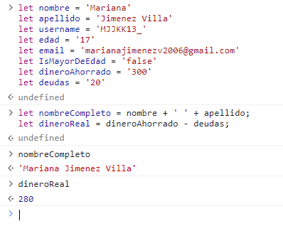
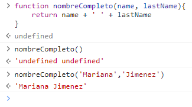
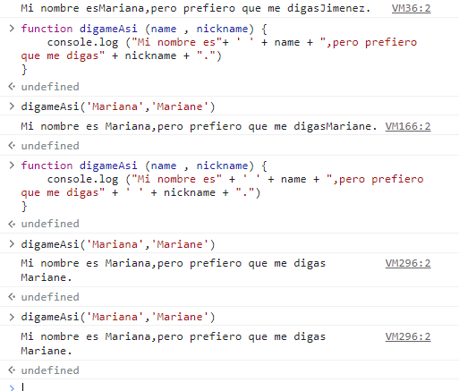
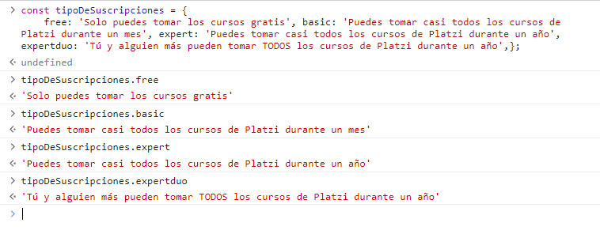

## Curso Práctico de JavaScript

# Prueba de JavaScript

    Variables
    Funciones
    Condicionales
    Ciclos
    Arrays y objetos
    Bonus: reducción de condicionales
    ¡Es tu turno: crea un tutorial!

# Manipulación del DOM

    Cómo conectar JavaScript con HTML
    Leyendo HTML desde JavaScript
    Escribiendo HTML desde JavaScript
    Eventos wn JavaScript: interactuando con usuarios
    addEventListener

# Contribución a proyectos

    Conectando GitHub a proyectos de JavaScript
    Proyectos con JavaScript y GitHub desde cero
    Fork a proyectos en GitHub
    Analizando código de proyectos open-source
    Fusión del menú en desktop
    Fusión del menú en mobile
    Carrito de compras
    Lista de productos: HTML a pastir de arrays
    Detalles de un producto
    Interacción entre todos los componentes
    Pull Requests: aportando código a proyectos en GitHub
    Feedback: conoce proyectos

# Despliegue

    Deploy con GitHub pages

